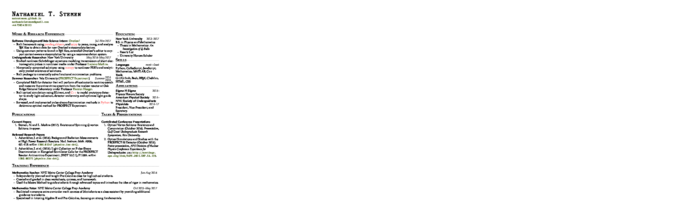

# *C*ult *V*oucher

My CV which will get me jobs/oppurtunities because it looks hot af and my name is pretty white.
Please use this, and give me credit if you want, but pretty sure I stole half of this from other people, so do what you want.

I've use this to

- apply for some jobs that never got back to me
- get into grad school

## Features

This repo also has two uses of [Github Actions](https://github.com/features/actions):

1.  Build the PDF from `main.tex` and deploy to server via `ssh`
2.  Remind me to update the damn thing quarterly by opening a github issue automatically.

These are done in [`build.yaml`](./.github/workflows/build.yaml) and [`remind.yaml`](./.github/workflows/remind.yaml) respectively.
They have saved me a lot of `ssh`-ing which if I can avoid, I will.

## A brief history

