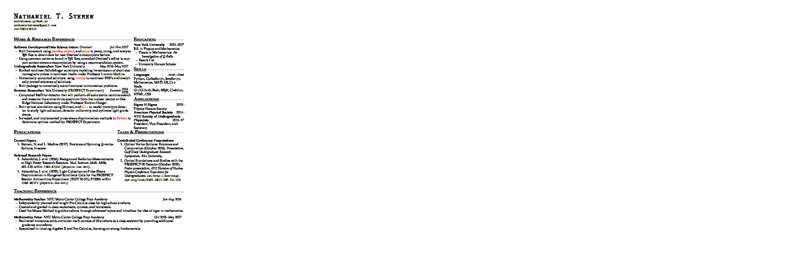

# *C*ult *V*oucher

My CV which will get me jobs/opportunities because it looks hot af and my name is pretty white.
Please use this, and give me credit if you want, but pretty sure I stole half of this from other people, so do what you want.

I've used this to

- apply for some jobs that never got back to me
- get rejected from grad school

## Building

You'll need texlive and biber, then run `latexmk` in the root of the repo.

## Features

This repo also has two uses of [Github Actions](https://github.com/features/actions):

1.  Build the PDF from `main.tex` and push it to my website repo.
2.  Remind me to update the damn thing quarterly by opening a github issue automatically.

These are done in [`build.yaml`](./.github/workflows/build.yaml) and [`remind.yaml`](./.github/workflows/remind.yaml) respectively.

## A brief history

I've also written a script [`gif.sh`](./gif.sh) to generate the following gif using the git history.
It requires [ImageMagick](https://imagemagick.org/) and [gifsicle](https://www.lcdf.org/gifsicle/):

```
bash gif.sh
```


